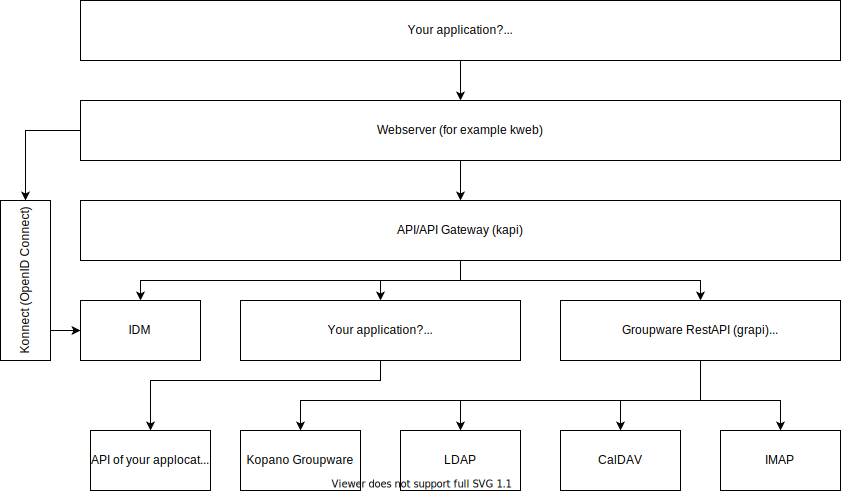

# Development

## Architecture

## Backends

LibreGraph was designed with a pluggable backend system in mind. Backends can be mixed and backends providing the same data (e.g. Kopano and IMAP for mail access) can be used at the same time.

### Kopano

State: In active development

Full groupware backend using the Kopano Groupware as storage.

### CalDAV

State: proof of concept

### IMAP

State: proof of concept

### LDAP

State: proof of concept

Capable of a read-only presentation of shared contacts.

### Mock

Empty backend for testing

### Write your own

TODO

## Contribute

Join the [discussion](https://github.com/LibreGraph/libregraph.github.io/discussions)!
